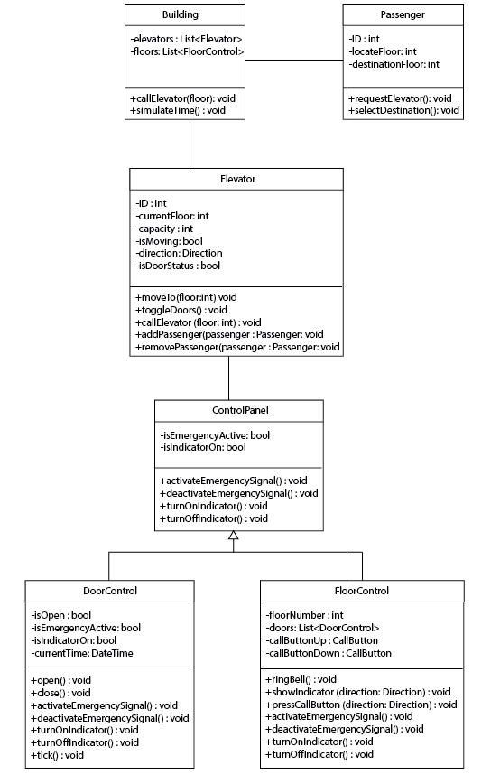

# Kodluyoruz Sigorta Şirketi Asansör Simülatörü

Bu proje, Kodluyoruz Sigorta Şirketi'nin 12 katlı bir ofis binasında asansörlerin işlemlerini modelleyen bir yazılım simülatörüdür. Amaç, binanın trafik akış ihtiyaçlarını analiz etmek ve asansörlerin performansını değerlendirmektir.

---

## Projenin Özeti

### Genel Bilgi
- **Binada 12 kata hizmet eden 5 asansör bulunmaktadır.**
- Her asansör:
  - **6 yetişkin yolcu kapasitesine sahiptir.**
  - Enerji tasarruflu çalışacak şekilde tasarlanmıştır ve yalnızca gerektiğinde hareket eder.
  - Kat gösterge ışıkları, kontrol panelleri ve kapılarla donatılmıştır.

### Katlar ve Asansörler
- Her katta:
  - **Beş asansör boşluğu** bulunur.
  - Her asansör boşluğu için:
    - **Kapı**, **varış zili** ve **sinyal ışığı** vardır.
  - **Yukarı** ve **aşağı çağrı düğmeleri** bulunur.
- Yolcular, yukarı/aşağı düğmelere basarak asansör çağırır.
- Çağrıyı alan bir programlayıcı, **uygun bir asansörü kata yönlendirir.**

### Simülasyon Özellikleri
1. **Gerçek Zamanlı Simülasyon:**  
   Saat sistemi ile zaman geçişi simüle edilir.
2. **Rastgele Yolcu Oluşturma:**  
   Yolcuların başlangıç ve varış katları rastgele belirlenir.
3. **Olay Günlüğü:**  
   Tüm simülasyon olayları zaman damgasıyla kaydedilir.

---

## Proje Mimarisi

### Sınıflar ve Özellikler

1. **Building (Bina)**  
   - Binayı yönetir ve katlarla asansör listesini tutar.
   - **Metotlar:**
     - `callElevator(floor: int): void`
     - `simulateTime(): void`

2. **Elevator (Asansör)**  
   - Katlar arasında yolcu taşır ve asansör durumunu kontrol eder.
   - **Özellikler:**
     - Kapasite, mevcut kat, hareket durumu, yön bilgisi gibi detayları tutar.
   - **Metotlar:**
     - `moveTo(floor: int): void`
     - `toggleDoors(): void`
     - `callElevator(floor: int): void`
     - `addPassenger(passenger: Passenger): void`
     - `removePassenger(passenger: Passenger): void`

3. **Passenger (Yolcu)**  
   - Asansör kullanan bireyleri temsil eder.
   - **Metotlar:**
     - `requestElevator(): void`
     - `selectDestination(): void`

4. **ControlPanel (Kontrol Paneli)**  
   - Asansör içi kontrolleri ve acil durum sinyallerini yönetir.
   - **Metotlar:**
     - `activateEmergencySignal(): void`
     - `deactivateEmergencySignal(): void`
     - `turnOnIndicator(): void`
     - `turnOffIndicator(): void`

5. **DoorControl (Kapı Kontrolü)**  
   - Asansör kapılarını yönetir.
   - **Metotlar:**
     - `open(): void`
     - `close(): void`
     - `tick(): void`

6. **FloorControl (Kat Kontrolü)**  
   - Kat çağrı düğmelerini, sinyal ışıklarını ve zil seslerini yönetir.
   - **Metotlar:**
     - `pressCallButton(direction: Direction): void`
     - `ringBell(): void`

---

## Diyagram

Sistemin sınıf diyagramı aşağıda verilmiştir:

---

## Geliştirme

Proje, yazılım mühendisliği tasarımı olarak hazırlanmıştır. Diyagram ve açıklamalar referans alınarak sistem daha fazla detaylandırılabilir ve uygulamaya dönüştürülebilir.

## Lisans

Bu proje tamamen [Melek Demirhan] tarafından geliştirilmiştir. Tüm hakları saklıdır. Projenin izinsiz bir şekilde kopyalanması, dağıtılması veya kullanılması yasaktır.

### Telif Hakkı (Copyright)

© [2024] [Melek Demirhan]. Tüm hakları saklıdır.

