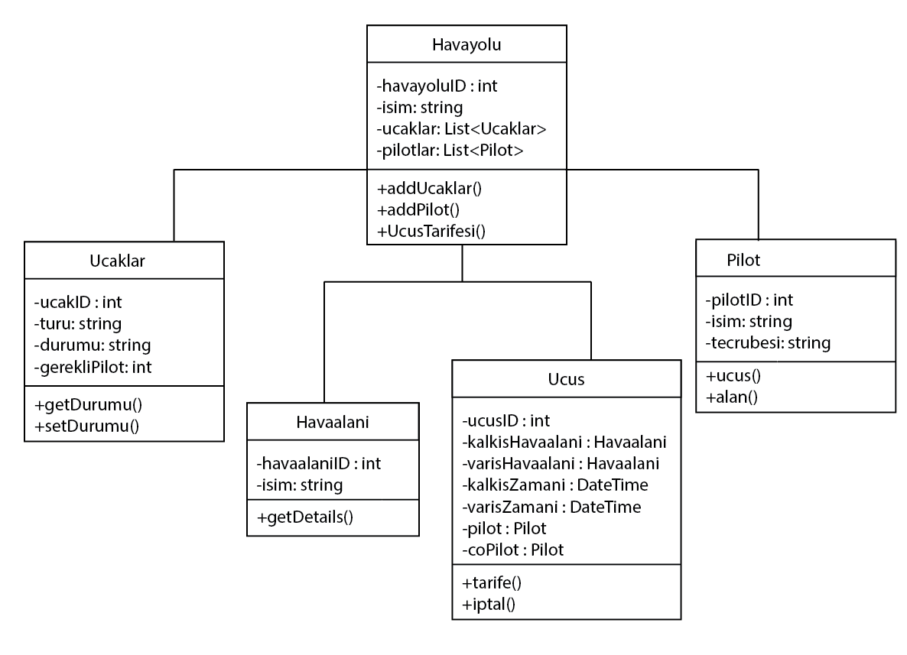

# Uçuş Yönetim Sistemi

Bu proje, hava yolu şirketlerinin, uçakların, pilotların ve uçuşların yönetimi için bir sistem tasarımını içermektedir. Aşağıda sistemin özellikleri ve sınıf diyagramına uygun olarak hazırlanmış açıklamalar yer almaktadır.

---

## Özellikler

- **Hava Yolu Şirketi Yönetimi:**  
  Hava yolu şirketleri, uçak filoları ve çalışan pilotlar yönetilir.

- **Uçak Yönetimi:**  
  Uçaklar, türlerine ve mevcut durumlarına (`Çalışır` veya `Bakımda`) göre takip edilir.

- **Uçuş Yönetimi:**  
  Uçuşlar, benzersiz kimlikler, kalkış ve varış havaalanları ile zaman bilgileri ve pilot atamaları ile planlanır.

- **Pilot Yönetimi:**  
  Pilotlar, kimlikleri, deneyim seviyeleri ve uçuş görevleri ile sistemde yer alır.

- **Havaalanı Yönetimi:**  
  Benzersiz kimliklere ve isimlere sahip havaalanları sistemde saklanır.

---

## Sistem Tasarımı

### Sınıflar ve Özellikler

1. **Havayolu (Airline)**  
   - `havayoluID`: Hava yolu şirketine ait benzersiz kimlik.  
   - `isim`: Hava yolu şirketinin adı.  
   - `ucaklar`: Hava yoluna ait uçakların listesi.  
   - `pilotlar`: Hava yolunda çalışan pilotların listesi.  
   - **Metotlar:**  
     - `addUcaklar()`: Hava yoluna uçak ekler.  
     - `addPilot()`: Hava yoluna pilot ekler.  
     - `UcusTarifesi()`: Mevcut uçuş tarifesini oluşturur veya görüntüler.

2. **Uçaklar (Aircraft)**  
   - `ucakID`: Uçağın benzersiz kimliği.  
   - `turu`: Uçağın türü (örneğin, Boeing 737, Airbus A320).  
   - `durumu`: Uçağın mevcut durumu (`Çalışır` veya `Bakımda`).  
   - `gerekliPilot`: Uçak tipi için gerekli pilot sayısı.  
   - **Metotlar:**  
     - `getDurumu()`: Uçağın mevcut durumunu getirir.  
     - `setDurumu()`: Uçağın durumunu değiştirir.

3. **Pilot**  
   - `pilotID`: Pilotun benzersiz kimliği.  
   - `isim`: Pilotun adı.  
   - `tecrubesi`: Pilotun deneyim seviyesi (örneğin, Kıdemli, Orta, Acemi).  
   - **Metotlar:**  
     - `ucus()`: Pilota bir uçuş atar.  
     - `alan()`: Pilotun çalıştığı hava yolunu görüntüler.

4. **Havaalanı (Airport)**  
   - `havaalaniID`: Havaalanının benzersiz kimliği.  
   - `isim`: Havaalanının adı.  
   - **Metotlar:**  
     - `getDetails()`: Havaalanına ait detayları döner.

5. **Uçuş (Flight)**  
   - `ucusID`: Uçuşun benzersiz kimliği.  
   - `kalkisHavaalani`: Uçuşun kalkış yapacağı havaalanı.  
   - `varisHavaalani`: Uçuşun varış yapacağı havaalanı.  
   - `kalkisZamani`: Planlanan kalkış zamanı.  
   - `varisZamani`: Planlanan varış zamanı.  
   - `pilot`: Uçuşa atanan baş pilot.  
   - `coPilot`: Uçuşa atanan yardımcı pilot.  
   - **Metotlar:**  
     - `tarife()`: Uçuşun tarifesini ayarlar veya görüntüler.  
     - `iptal()`: Uçuşu iptal eder.

---

## Kullanım Alanları

Bu sistem, hava yolu operasyonlarını yönetmek, uçuş planlaması yapmak ve pilotların, uçakların ve havaalanlarının koordinasyonunu sağlamak için kullanılabilir.

---

## Diyagram

Sistemin sınıf diyagramı aşağıda verilmiştir:

---

## Geliştirme

Proje, yazılım mühendisliği tasarımı olarak hazırlanmıştır. Diyagram ve açıklamalar referans alınarak sistem daha fazla detaylandırılabilir ve uygulamaya dönüştürülebilir.

