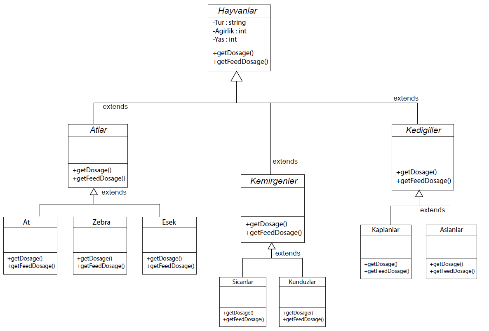

# Hayvanat Bahçesi Yönetim Sistemi

Bu proje, bir hayvanat bahçesindeki hayvanların bilgilerinin takip edilmesini, yemleme ve ilaçlama işlemlerinin yönetilmesini sağlayan bir yazılım sistemi tasarımı sunar. Tasarım, **polimorfizm** ilkesine dayalıdır ve esnek bir sınıf hiyerarşisi içerir.

## Proje Gereksinimleri

- **Hayvan Grupları:**
  - **Atlar:** Atlar, zebralar, eşekler vb.
  - **Kedigiller:** Kaplanlar, aslanlar vb.
  - **Kemirgenler:** Sıçanlar, kunduzlar vb.
  
- **Ortak Özellikler:**
  - Tüm hayvanlar için aşağıdaki bilgiler takip edilmelidir:
    - **Tür Adı:** Hayvanın türünü tanımlar.
    - **Ağırlık:** Hayvanın ağırlığını belirtir.
    - **Yaş:** Hayvanın yaşını belirtir.

- **Davranışlar:**
  - **İlaç Dozajı Hesaplama (`getDosage`):** Her hayvan grubu için ilaç dozajını belirler.
  - **Yemleme Zamanı Hesaplama (`getFeedSchedule`):** Her hayvan grubu için yemleme zamanını hesaplar.
  - Bu işlemlerin algoritmaları hayvan gruplarına göre farklılık gösterir.

## Tasarım Prensipleri

- **Soyutlama:** Tüm hayvanlar için ortak olan özellikler ve davranışlar soyut bir sınıfta tanımlanmıştır.
- **Polimorfizm:** Her hayvan grubu, ortak davranışları özelleştirebilmek için base sınıfın soyut metotlarını kendi ihtiyaçlarına göre override eder.
- **Genişletilebilirlik:** Yeni hayvan grupları kolayca eklenebilir.

## Sınıf Diyagramı

- **Base Class:** `Hayvan`
  - **Ortak Özellikler:**
    - `turAdi`
    - `agirlik`
    - `yas`
  - **Soyut Metotlar:**
    - `getDosage()`
    - `getFeedSchedule()`

- **Alt Sınıflar:**
  - `Atlar`
  - `Kedigiller`
  - `Kemirgenler`

## UML Çizimi

## Lisans

Bu proje tamamen [Melek Demirhan] tarafından geliştirilmiştir. Tüm hakları saklıdır. Projenin izinsiz bir şekilde kopyalanması, dağıtılması veya kullanılması yasaktır.

### Telif Hakkı (Copyright)

© [2024] [Melek Demirhan]. Tüm hakları saklıdır.