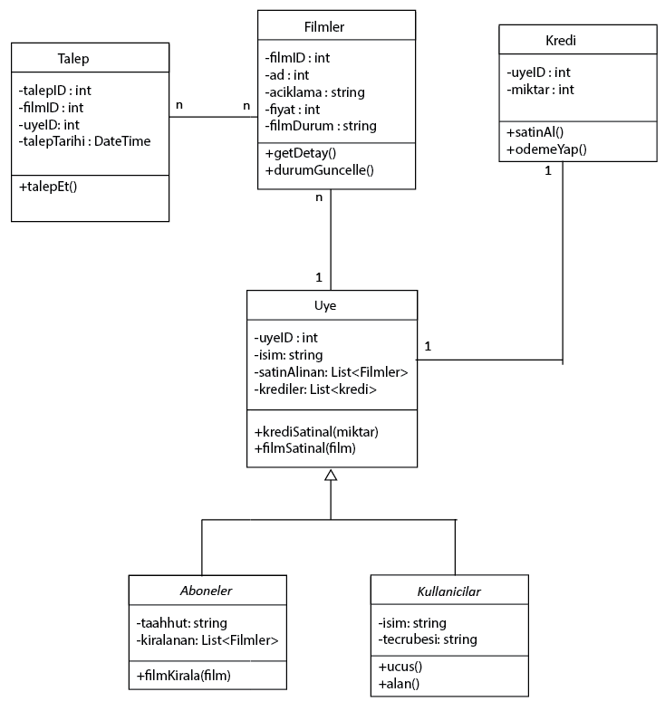

# Film Kiralama ve Abonelik Sistemi

Bu proje, film kiralama ve abonelik yönetim sistemi üzerine tasarlanmıştır. Sistemde kullanıcılar, abonelik için kredi satın alabilir ve filmleri kiralayabilirler. Kullanıcılar ayrıca filmleri satın alabilir veya talep edebilirler.

## Sınıf Diyagramı

Sistemi tasvir eden sınıf diyagramı aşağıdaki ilişkileri içerir:

- `Uye` sınıfı, `Aboneler` ve `Kullanicilar` sınıflarından türemektedir.
- `Uye` sınıfı ile bir `Kredi` sınıfı arasında birebir ilişki vardır.
- `Filmler` sınıfı, `Talep` sınıfı ile çoktan çoğa ilişkiye sahiptir.
- `Uye` sınıfı, kullanıcı bilgilerini tutar ve kredi bakiyesini yönetir.
- `Kredi` sınıfı, her kullanıcının ne kadar krediye sahip olduğunu tutar.
- `Filmler` sınıfı, film bilgilerini içerir ve kullanıcılar tarafından kiralanabilir veya talep edilebilir.
- `Talep` sınıfı, film talebinin yönetilmesini sağlar ve film mevcut değilse kullanıcının talep oluşturmasına olanak tanır.

## Sistem Özellikleri

1. **Filmler:**
   - Film listeleri görüntülenebilir.
   - Filmler sıralanabilir (örneğin, türüne veya popülerliğine göre).
   - Kullanıcılar filmleri kiralayabilir veya satın alabilir.
   - Kiralama için abonelik gereklidir ve kredi ile yapılır.
   - Eğer bir film mevcut değilse, kullanıcılar film talep edebilir.

2. **Abonelik ve Kredi Sistemi:**
   - Kullanıcılar abonelik için kredi satın alabilirler.
   - Yalnızca aboneler, kiralama işlemini gerçekleştirebilir.
   - Kredi, kiralama işlemleri için kullanılır.

## Sınıflar

### `Uye` (Abstract Class)
- Tüm kullanıcıların ortak özelliklerini içerir.
- Kullanıcı adı, e-posta ve kredi bilgilerini tutar.

### `Aboneler` (Class)
- `Uye` sınıfından türetilir.
- Abone olan kullanıcıları temsil eder.
- Abonelik süresi ve aktif durum gibi bilgileri içerir.

### `Kullanicilar` (Class)
- `Uye` sınıfından türetilir.
- Normal kullanıcıları temsil eder.
- Abonelik özellikleri yoktur, ancak film satın alabilirler.

### `Kredi` (Class)
- Bir kullanıcıya ait kredi miktarını tutar.
- Kredi bakiyesi, kullanıcı tarafından kiralama işlemleri yapıldıkça azalır.

### `Filmler` (Class)
- Film bilgilerini içerir (isim, tür, açıklama, fiyat vb.).
- Bir film birden fazla talep alabilir.
- Kullanıcılar bu filmleri kiralayabilir veya satın alabilirler.

### `Talep` (Class)
- Kullanıcıların mevcut olmayan filmler için talep oluşturmasını sağlar.
- Film mevcut olduğunda, kullanıcıya bildirim yapılır.

## Kullanım Talimatları

1. **Kredi Satın Alma:**
   - Kullanıcılar kredi satın almak için ödeme yapabilirler.
   - Satın alınan kredi, kullanıcının hesabına eklenir.

2. **Film Kiralama:**
   - Abonelikleri olan kullanıcılar, kredi bakiyeleri ile film kiralayabilirler.
   - Film kiralama işlemi sırasında kredi bakiyesi, kiralanan film bedeli kadar azalır.

3. **Film Satın Alma:**
   - Hem aboneler hem de normal kullanıcılar filmleri satın alabilirler.
   - Film bedeli doğrudan kullanıcının hesabından düşülür.

4. **Film Talep Etme:**
   - Kullanıcılar, mevcut olmayan filmler için talep oluşturabilirler.
   - Talep edilen film, sisteme eklendiğinde kullanıcıya bildirilir.

## Proje Yapısı

- **`Uye.cs`**: Kullanıcı temel sınıfı.
- **`Aboneler.cs`**: Abonelik durumu ile ilişkili sınıf.
- **`Kullanicilar.cs`**: Normal kullanıcı sınıfı.
- **`Kredi.cs`**: Kredi işlemleri ile ilgili sınıf.
- **`Filmler.cs`**: Film bilgilerini tutan sınıf.
- **`Talep.cs`**: Film taleplerini yöneten sınıf.

## Lisans

Bu proje MIT lisansı ile lisanslanmıştır - daha fazla bilgi için `LICENSE` dosyasına bakabilirsiniz.

## Diyagram

Sistemin sınıf diyagramı aşağıda verilmiştir:

